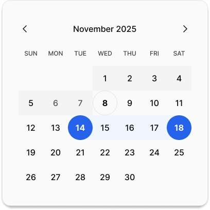

# 📅 MDatePicker

> The missing custom SiwftUI date picker for macOS



## ✨ Features

- 🎯 Native macOS look and feel
- 🖥️ Clean and minimal UI
- 📱 Responsive design
- 🎨 Follows system appearance (Light/Dark mode)

## 🚀 Installation

1. Use Swift Package Manager with following url
```bash
https://github.com/Momentumos/MDatePicker
```
## 💡 Usage

Import MDatePicker into your macOS project and use it like this:

```swift
//Define a state variable to hold the picked date
//For picking single dates
@State var pickedSingleDate = MPickedDate.single(.now)

//For picking a date range
@State var dateValue: MPickedDate? = .range(Calendar.current.date(byAdding: .day, value: -2, to: .now) ?? .now, Calendar.current.date(byAdding: .day, value: 2, to: .now) ?? .now)

//Use in any view
MDatePicker(pickedDate: $dateValue)
```

## 🛠️ Requirements
- macOS 14.0
- iOS 13.0

## 🤝 Contributing
Contributions are welcome! Feel free to:

1. Fork the project
2. Create your feature branch
3. Submit a pull request


## 📝 License
This project is available under the MIT license. See the LICENSE file for more info.

## ⭐ Show Your Support
Give a ⭐️ if this project helped you!

## 📫 Contact
Created by @Momentumos

This README template provides a professional and engaging presentation of the MDatePicker project with clear sections, emojis for visual appeal, and all essential information a developer would need. Feel free to customize the content further based on specific features and requirements of your implementation!
